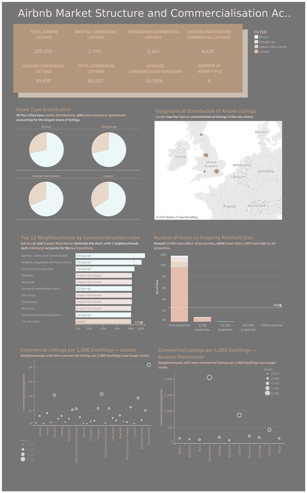

# Airbnb Market Structure and Commercialisation Across UK Cities

An analysis of Airbnb listings across four UK cities, using **SQL for data cleaning and analysis** and **Tableau for visualisation**. The project explores listing patterns, host commercialisation, geographical concentration, and housing exposure.

## 1. Data Sources

This project uses data from two main sources:

* **Office for National Statistics (ONS)** — Housing Price Index, Private Rental Price Index, and dwelling stock data.
* **Inside Airbnb** — Short-term rental listing data, including neighbourhood, location, room type, host listing count, reviews, and availability.

## 2. Key Highlights

* Over 50% of listings are used for commercial purposes on average.
* Entire homes/apartments and private rooms are the most common room types.
* London has the highest concentration of listings in the city centre.
* Edinburgh and Greater Manchester have the most neighbourhoods with high commercialisation indices.
* Most hosts list between 2 and 10 properties.
* Neighbourhoods with more commercial listings per 1,000 dwellings have higher listing density.

## 3. Data Cleaning and Preparation

SQL was used to prepare the data for analysis:

* Removed records with missing values.
* Removed unnecessary columns.
* Grouped hosts into property-count categories.
* Prepared datasets for Tableau visualisation.

## 4. Visualisation

Created a one-page interactive dashboard in **Tableau** to explore Airbnb market structure and commercialisation across the four cities.

**Tableau Dashboard:**
[View the interactive dashboard](https://public.tableau.com/app/profile/ka.yan.chong/viz/AirbnbMarketStructureandCommercialisationAcrossUKCities/Dashboard4)
